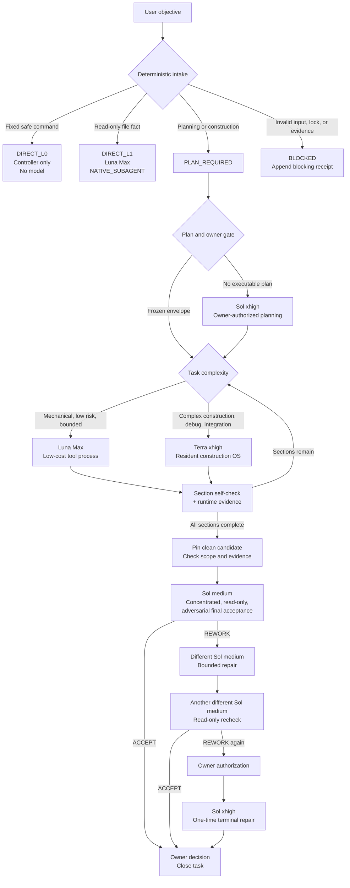

# Codex Team

[中文](README.md)

Codex Team is a local, resumable, auditable, semi-automated multi-model collaboration workflow for Codex. It turns “who acts, what they may change, when they must stop, and who accepts the result” from model discretion into task envelopes, deterministic routing, runtime identity, evidence chains, and human gates.

It addresses three common failure modes in multi-model work: assigning a low-cost model work outside its capability boundary, allowing a rework loop to expand the write scope, and accepting a result without traceable evidence. Codex Team keeps those boundaries in a small, strict control plane while leaving high-risk decisions to the human owner.

It is intended for personal development, experiments, and local workflows that use different model capabilities while retaining an audit trail. It is not a background service, does not promise to make product decisions for the user, and never implicitly merges, pushes, or deletes a workspace.

| Project status | Current value |
|---|---|
| Plugin version | `0.4.0` |
| Release posture | Public preview; self-use first, no production SLA |
| Default Luna execution surface | Native `NATIVE_SUBAGENT`: `gpt-5.6-luna / max` |
| Resident entry-route suggestion | Luna max; documentation-only suggestion, effective routing remains deterministic and user-selected |
| Default construction OS | Terra xhigh |
| Final acceptance | Concentrated, read-only, adversarial Sol medium review |
| Last updated | 2026-08-29 |
| License | Not declared; public visibility does not grant redistribution rights |

## What this is

Codex Team consists of standard-library implementations, schemas, a Plugin mirror, CLI commands, and tests. The production path is centered on a zero-model control plane: validate the task and evidence first, then execute the frozen role, scope, and command contract. A model starts only at an explicitly authorized boundary.

### Default role split

| Role | Default model / effort | Primary responsibility | Explicit boundary |
|---|---|---|---|
| Luna Max | `gpt-5.6-luna / max` | Mechanical coding inside a frozen envelope, deterministic checks, evidence extraction, and distribution sync | Never planning, reviewing, approving, or final acceptance |
| Terra xhigh | `gpt-5.6-terra / xhigh` | Complex construction, debugging, integration, and open-ended problem decomposition | Never merge, push, or self-accept |
| Sol medium | `gpt-5.6-sol / medium` | Supervise the implementation of the overall plan, perform concentrated final acceptance, and run the bounded rework ladder | Not resident construction; acceptance stays read-only and adversarial |
| Sol xhigh | `gpt-5.6-sol / xhigh` | Owner-authorized overall planning or terminal escalation after the rework ladder | Never starts automatically or bypasses the owner gate |

Luna does not perform planning, review, approval, or final acceptance. Terra does not merge, push, or self-accept. Sol xhigh does not start automatically. Models and reasoning levels not explicitly listed in configuration are never silently injected into the workflow.

## Routing at a glance

The diagram below shows the default production path: deterministic triage first, then a frozen envelope; intermediate engineering sections perform construction self-checks only, and Sol medium performs the concentrated final acceptance. Every write edge is constrained by task scope, runtime identity, evidence, and an owner gate.



The routing trade-off is deliberate: Luna handles frequent, low-cost, mechanically verifiable work; Terra xhigh handles construction that needs context and debugging; Sol medium enters only after all engineering sections are complete and looks for omissions; Sol xhigh handles the terminal exception only after explicit owner authorization. `optimization` is shadow advice by default and never silently changes this deterministic production chain.

## Quick start

Requirements: Python 3.11+, Git, and a POSIX shell. The Plugin verifier also requires `jq`. The project adds no third-party Python dependencies.

```sh
git clone https://github.com/New2taste/codex-team.git codex-team
cd codex-team

sh scripts/verify_all.sh
```

Optional Skill validation (requires the local Codex skill-creator installation):

```sh
python3 "$CODEX_HOME/skills/.system/skill-creator/scripts/quick_validate.py" \
  plugins/ai-workflow/skills/orchestration
```

## Codex Team invocation

The tool name is `codex team`; the shortest natural-language command is `team call`. Only a leading directive in one of these forms is parsed:

```text
team call <objective>
team call: <objective>
team call：<objective>
```

Examples:

```sh
codex team "team call inspect the current workspace"
codex team "team call check README.md"
```

Equivalent repository entry point:

```sh
python3 scripts/ai_workflow.py team-call \
  "team call inspect the current workspace" \
  --repository-root "$PWD"
```

Codex Team has four constrained dispositions:

- `DIRECT_L0`: the controller runs a fixed allowlist argv; no model is called;
- `DIRECT_L1`: Luna performs a bounded, read-only extraction of one safe repository-relative file;
- `PLAN_REQUIRED`: return to the planning workflow and its human owner gate;
- `BLOCKED`: input, lock, permission, or execution evidence is insufficient.

The command does not modify, merge, push, or replace final acceptance. Failed calls return exit code `2` and retain an append-only receipt ledger.

## Lifecycle

### 1. Planning

```text
Objective → task envelope and deterministic evidence checks
→ DIRECT_L1 Luna fact extraction when needed
→ Terra read-only planning only when an executable plan is missing
→ owner decision
```

### 2. Construction and acceptance

```text
Freeze envelope → bounded construction → target tests, negative checks, scope checks
→ all engineering sections complete → pin candidate commit
→ Sol medium final acceptance → owner decision
```

Intermediate engineering sections use `section_self_check_only`: the construction owner must run the frozen-envelope tests, negative checks, scope checks, and runtime-evidence gate, but no separate adversarial reviewer is dispatched per section. Self-check is not acceptance.

The scheduler creates one whole-project `ACCEPTANCE` child after all section receipts are complete. The final candidate must be the current clean HEAD and a descendant of the FrozenPlan candidate; its diff must stay inside the step/parent write union. `FINAL_ACCEPTANCE_OPENED` binds the child task hash, and `scheduler-parent.json` points back to the unique parent, plan, event, and candidate. `schedule-final` issues only one Sol-medium `REVIEW_1`; it does not run a model itself.

### 3. Rework after acceptance

```text
Sol medium REWORK
→ human approval of frozen findings, paths, and commands
→ different Sol-medium fixer with bounded write access
→ another different Sol-medium read-only recheck
→ only a second REWORK may reach owner-authorized Sol-xhigh terminal repair
```

Rework cannot expand the candidate, allowed paths, or verification commands. The Sol-xhigh terminal repair is a one-time exception and does not grant ordinary resident construction permission.

## Identity and evidence

The default Luna path uses `NATIVE_SUBAGENT` and must prove all of the following at runtime:

- workflow role `luna`;
- model and reasoning effort `gpt-5.6-luna / max`;
- `agent_type=null`;
- native agent UUID, thread UUID, sandbox, permission, and cwd;
- consistency between controlled dispatch parameters and rollout evidence.

`CODEX_EXEC_ROLE_CONTRACT` is a separate execution surface and cannot impersonate native Luna. Missing or conflicting identity, permission, thread, model, or effort evidence fails closed.

Each task is anchored to a fixed `base_commit`, `candidate_commit`, authorized file set, and verification commands. Strict schemas or append-only ledgers retain task, route, result, cost, runtime evidence, owner decisions, and rework events.

## Security boundaries

- Writes happen only in a named isolated worktree and frozen path set;
- a read-only role that changes files, moves HEAD, escapes scope, or lacks evidence is immediately `BLOCKED`;
- project secrets are not passed to child processes, and logs do not record environment variables or complete raw payloads;
- merge, push, worktree deletion, and global configuration changes are not automatic;
- task scope, runtime identity, and evidence must agree before execution continues.

## Repository map

```text
config/                         # Task, route, plan, result, runtime, cost, and advice schemas
scripts/ai_workflow.py          # Main CLI, state machine, and Codex Team entry point
scripts/ai_workflow_runtime.py  # Native/exec identity and runtime evidence
scripts/ai_workflow_artifacts.py# Strict artifact validation and data classes
scripts/ai_workflow_routing.py  # Terra OS closed-set routing; advice stays in a sidecar
scripts/ai_workflow_planning.py # Plan and construction envelopes
scripts/ai_workflow_scheduler.py# Batch scheduling, receipts, and final ACCEPTANCE child
scripts/ai_workflow_repairs.py  # Acceptance repair ledger v2
scripts/ai_workflow_team_call.py# Codex Team grammar, classification, and receipts
scripts/ai_workflow_router_probe.py # Offline shadow research for resident routing
scripts/sync_plugin.py           # Fixed-manifest Plugin parity check and sync
scripts/verify_all.sh            # Zero-model full verification entry point
plugins/ai-workflow/             # Published Plugin; runtime/config mirror the root
tests/                           # Fake runners, negative injection, and distribution tests
```

The production scheduler sequence is `schedule-batch` → `schedule-result` → `schedule-receipt` → `schedule-final`. The controller derives the result path from the bound dispatch, validates `dispatch_id/task_id/step_id/attempt`, and rejects symlinks, hardlinks, directory replacement, and oversized output. After all receipts complete, `schedule-final` creates the concentrated acceptance child; providing a verified owner receipt and a Sol-medium acceptor issues `REVIEW_1`.

The router probe is deliberately separate from production routing. It is a shadow-only research tool for comparing Luna, Sol, and Terra on paired hot/cold prefixes. It does not write the task store or change `effective_route`; real cost claims remain unavailable until measured rates, complete paired cases, stable prefixes, and downstream counterfactual cost evidence exist. The documented resident entry suggestion is Luna max, not a measured cost winner.

## Verification and development

```sh
sh scripts/verify_all.sh
```

`python3.11 scripts/sync_plugin.py --check` checks the fixed manifest; `--write` replaces Plugin copies from the root authority. Full verification runs the unit suite, compileall, Plugin verifier, shell syntax checks, runtime/config parity, import-graph checks, and `git diff --check`. Before a release, also tamper with one mirrored file in a temporary copy and confirm that the verifier rejects it.

## Current limitations

- Public preview focused on self-use and experimentation; no production SLA;
- live rollout, model availability, and billing data still require validation in the actual Codex environment;
- native Windows lifecycle is outside the current verification scope.

## Documentation

- [Architecture notes](docs/ARCHITECTURE.md)
- [Contributing and verification](CONTRIBUTING.md)
- [Changelog](CHANGELOG.md)
