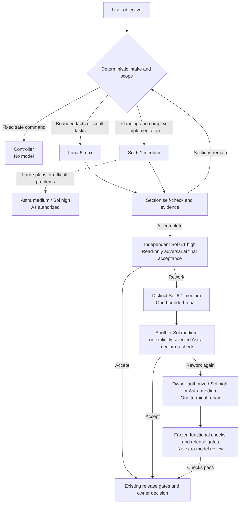

# Codex Team

[中文](README.md)

Codex Team is a local, resumable, auditable, semi-automated multi-model collaboration workflow for Codex. It turns “who acts, what they may change, when they must stop, and who accepts the result” from model discretion into task envelopes, deterministic routing, runtime identity, evidence chains, and human gates.

It addresses three common failure modes in multi-model work: assigning a low-cost model work outside its capability boundary, allowing a rework loop to expand the write scope, and accepting a result without traceable evidence. Codex Team keeps those boundaries in a small, strict control plane while leaving high-risk decisions to the human owner.

It is intended for personal development, experiments, and local workflows that use different model capabilities while retaining an audit trail. It is not a background service, does not promise to make product decisions for the user, and never implicitly merges, pushes, or deletes a workspace.

| Project status | Current value |
|---|---|
| Plugin version | `0.4.1` |
| Release posture | Public preview; self-use first, no production SLA |
| Default Luna execution surface | Native `NATIVE_SUBAGENT`: `gpt-6-luna / max` |
| Entry classification | Deterministic rules; no model call by default |
| Primary implementer | `gpt-6.1-sol / medium` |
| Final acceptance | Concentrated, read-only, adversarial `gpt-6.1-sol / high` review |
| Last updated | 2026-09-30 |
| License | Not declared; public visibility does not grant redistribution rights |

## What this is

Codex Team consists of standard-library implementations, schemas, a Plugin mirror, CLI commands, and tests. The production path is centered on a zero-model control plane: validate the task and evidence first, then execute the frozen role, scope, and command contract. A model starts only at an explicitly authorized boundary.

### Default role split

| Role | Model / effort | Responsibility | Boundary |
|---|---|---|---|
| Luna Max | `gpt-6-luna / max` | Batch bounded, mechanically verifiable tasks, checks and evidence extraction | Hand failures and evidence back; never plan, review, approve or retry repeatedly |
| Primary implementer | `gpt-6.1-sol / medium` | Routine coordination, ordinary planning, construction, debugging, integration and first bounded repair | Never merge, push or self-accept |
| Final reviewer and difficult-work escalation | `gpt-6.1-sol / high` | Independent, read-only, adversarial final acceptance; difficult work or authorized terminal repair | Review and scoped-write repair are separate phases |
| Astra medium | `gpt-6-astra / medium` | Large-project planning, stubborn problems, supplementary independent recheck or authorized terminal repair | Optional; rechecks stay read-only and terminal repairs require owner authorization |

Ordinary plans stay with Sol medium. After Sol high final acceptance recommends rework, a distinct Sol medium fixer repairs the frozen findings. Another Sol medium independently rechecks; explicitly select Astra medium when an additional perspective is needed. A failed recheck permits only one owner-authorized Sol high or Astra medium terminal repair. Frozen functional checks and existing release gates remain mandatory, without additional task-level model review.

Historical role/command IDs remain compatibility handles: `terra_xhigh` means the primary implementer, `sol_reviewer` means Sol high final acceptance, `sol_medium_reviewer` means Sol medium repair/recheck, and `astra_medium_reviewer` means Astra medium recheck. `sol_xhigh` and `authorize_final_xhigh` retain their compatibility IDs. Runtime receipts establish the actual model, effort and permissions.

### Routing at a glance

Deterministic intake selects the authorized envelope. Intermediate engineering sections use `section_self_check_only`; final acceptance runs only after all sections complete.


```mermaid
flowchart TD
    A[User objective] --> B{Deterministic intake and scope}
    B -->|Fixed safe command| C[Controller<br/>No model]
    B -->|Bounded facts or small tasks| D[Luna 6 max]
    B -->|Planning and complex implementation| E[Sol 6.1 medium]
    E -. Large plans or difficult problems .-> F[Astra medium / Sol high<br/>As authorized]
    D --> G[Section self-check and evidence]
    E --> G
    G -->|Sections remain| B
    G -->|All complete| H[Independent Sol 6.1 high<br/>Read-only adversarial final acceptance]
    H -->|Accept| I[Existing release gates and owner decision]
    H -->|Rework| J[Distinct Sol 6.1 medium<br/>One bounded repair]
    J --> K[Another Sol medium<br/>or explicitly selected Astra medium recheck]
    K -->|Accept| I
    K -->|Rework again| L[Owner-authorized Sol high or Astra medium<br/>One terminal repair]
    L --> M[Frozen functional checks and release gates<br/>No extra model review]
    M -->|Checks pass| I
```

At most two subagents run by default, with at most one writer and two readers; single-step dispatch also checks capacity. Team Call retains its single active receipt. Delegate only useful independent work, batch related bounded tasks, and pass relevant context with every required scope and identity field intact.

Observe the next 10–20 real tasks using existing reports and cost evidence: total consumption, elapsed time, first-pass acceptance, reworks and missed defects. Savings are not yet measured; API costs and subscription usage are tracked separately.

## Quick start

Requirements: Python 3.11+, Git, and a POSIX shell. The Plugin verifier also requires `jq`. The project adds no third-party Python dependencies.

```sh
git clone https://github.com/New2taste/codex-team.git codex-team
cd codex-team

sh scripts/verify_all.sh
```

Optional Skill validation (requires the local Codex skill-creator installation):

```sh
python3 "$CODEX_HOME/skills/.system/skill-creator/scripts/quick_validate.py" \
  plugins/ai-workflow/skills/orchestration
```

## Codex Team invocation

Use `team call` in Codex chat to invoke this Skill; the native `codex` CLI has no `team` subcommand. Only a leading directive in one of these forms is parsed:

```text
team call <objective>
team call: <objective>
team call：<objective>
```

Examples:

```text
team call 检查当前工作区状态
team call 核对文件 README.md
```

Equivalent repository entry point:

```sh
python3 scripts/ai_workflow.py team-call \
  "team call inspect the current workspace" \
  --repository-root "$PWD"
```

Codex Team has four constrained dispositions:

- `DIRECT_L0`: the controller runs a fixed allowlist argv; no model is called;
- `DIRECT_L1`: Luna performs a bounded, read-only extraction of one safe repository-relative file;
- `PLAN_REQUIRED`: persist a real task and hash-bound planning handoff; default/fake mode starts no model, explicitly authorized live mode runs Sol medium read-only planning and stops at its owner gate;
- `BLOCKED`: input, lock, permission, or execution evidence is insufficient.

The command does not modify, merge, push, or replace final acceptance. Failed calls return exit code `2` and retain an append-only receipt ledger.

General calls return a durable task ID. In Codex, the orchestration Skill consumes `team-call-handoff.json`, dispatches actual Sol medium authorized planning/construction, verifies behavior, then invokes independent Sol high final acceptance. The CLI alone does not implement. Repeating the same call replays its receipt without creating or launching another task. Native identity and results must be observed, not fabricated from a label or pending handoff. Platform permission and macOS Chrome registration launch failures are environment blockers; do not repeat the same sandboxed launch or count them as implementation reworks.

Reuse existing `cost.jsonl`, runtime evidence and reports for 10–20 real matched Team/single-Sol-medium tasks with separate state roots. Match objective, starting revision, permissions and acceptance criteria. Record usage, time, first-pass acceptance, reworks, missed defects and environment blockers. Unknown usage is not zero; API cost and subscription quota are separate. Do not claim savings before measurement. Lower Luna efforts are bounded experiments only; production remains max.

## Lifecycle

### 1. Planning

```text
Objective → task envelope and deterministic evidence checks
→ DIRECT_L1 Luna fact extraction when needed
→ Sol medium ordinary planning; Astra medium only for authorized large projects
→ owner decision
```

### 2. Construction and acceptance

```text
Freeze envelope → bounded construction → target tests, negative checks, scope checks
→ all engineering sections complete → pin candidate commit
→ GPT-6.1 Sol high final acceptance → owner decision
```

Intermediate engineering sections use `section_self_check_only`: the construction owner must run the frozen-envelope tests, negative checks, scope checks, and runtime-evidence gate, but no separate adversarial reviewer is dispatched per section. Self-check is not acceptance.

The scheduler creates one whole-project `ACCEPTANCE` child after all section receipts are complete. The final candidate must be the current clean HEAD and a descendant of the FrozenPlan candidate; its diff must stay inside the step/parent write union. `FINAL_ACCEPTANCE_OPENED` binds the child task hash, and `scheduler-parent.json` points back to the unique parent, plan, event, and candidate. `schedule-final` issues only one GPT-6.1 Sol high `REVIEW_1`; it does not run a model itself.

### 3. Rework after acceptance

```text
GPT-6.1 Sol high REWORK
→ human approval of frozen findings, paths, and commands
→ GPT-6.1 Sol medium fixer with bounded write access
→ another Sol medium independent read-only recheck, or explicitly selected Astra medium
→ only a second REWORK may reach owner-authorized Sol-high or Astra-medium terminal repair
```

Rework cannot expand the candidate, allowed paths, or verification commands. The owner-authorized Astra-medium terminal repair is a one-time exception and does not grant ordinary resident construction permission; the same bound applies to Sol high terminal repair.

## Identity and evidence

The default Luna path uses `NATIVE_SUBAGENT` and must prove all of the following at runtime:

- workflow role `luna`;
- model and reasoning effort `gpt-6-luna / max`;
- `agent_type=null`;
- native agent UUID, thread UUID, sandbox, permission, and cwd;
- consistency between controlled dispatch parameters and rollout evidence.

`CODEX_EXEC_ROLE_CONTRACT` is a separate execution surface and cannot impersonate native Luna. Missing or conflicting identity, permission, thread, model, or effort evidence fails closed.

Each task is anchored to a fixed `base_commit`, `candidate_commit`, authorized file set, and verification commands. Strict schemas or append-only ledgers retain task, route, result, cost, runtime evidence, owner decisions, and rework events.

## Security boundaries

- Writes happen only in a named isolated worktree and frozen path set;
- a read-only role that changes files, moves HEAD, escapes scope, or lacks evidence is immediately `BLOCKED`;
- project secrets are not passed to child processes, and logs do not record environment variables or complete raw payloads;
- merge, push, worktree deletion, and global configuration changes are not automatic;
- task scope, runtime identity, and evidence must agree before execution continues.

## Repository map

```text
config/                         # Task, route, plan, result, runtime, cost, and advice schemas
scripts/ai_workflow.py          # Main CLI, state machine, and Codex Team entry point
scripts/ai_workflow_runtime.py  # Native/exec identity and runtime evidence
scripts/ai_workflow_artifacts.py# Strict artifact validation and data classes
scripts/ai_workflow_routing.py  # 主施工角色 closed-set routing; advice stays in a sidecar
scripts/ai_workflow_planning.py # Plan and construction envelopes
scripts/ai_workflow_scheduler.py# Batch scheduling, receipts, and final ACCEPTANCE child
scripts/ai_workflow_repairs.py  # Acceptance repair ledger v2
scripts/ai_workflow_team_call.py# Codex Team grammar, classification, and receipts
scripts/ai_workflow_router_probe.py # Offline shadow research for resident routing
scripts/sync_plugin.py           # Fixed-manifest Plugin parity check and sync
scripts/verify_all.sh            # Zero-model full verification entry point
plugins/ai-workflow/             # Published Plugin; runtime/config mirror the root
tests/                           # Fake runners, negative injection, and distribution tests
```

The production scheduler sequence is `schedule-batch` → `schedule-result` → `schedule-receipt` → `schedule-final`. The controller derives the result path from the bound dispatch, validates `dispatch_id/task_id/step_id/attempt`, and rejects symlinks, hardlinks, directory replacement, and oversized output. After all receipts complete, `schedule-final` creates the concentrated acceptance child; providing a verified owner receipt and a GPT-6.1 Sol high acceptor issues `REVIEW_1`.

The router probe is deliberately separate from production routing. It is a shadow-only research tool for comparing Luna, Sol, and Terra on paired hot/cold prefixes. It does not write the task store or change `effective_route`; real cost claims remain unavailable until measured rates, complete paired cases, stable prefixes, and downstream counterfactual cost evidence exist. The documented resident entry suggestion is Luna max, not a measured cost winner.

## Verification and development

```sh
sh scripts/verify_all.sh
```

`python3.11 scripts/sync_plugin.py --check` checks the fixed manifest; `--write` replaces Plugin copies from the root authority. Full verification runs the unit suite, compileall, Plugin verifier, shell syntax checks, runtime/config parity, import-graph checks, and `git diff --check`. Before a release, also tamper with one mirrored file in a temporary copy and confirm that the verifier rejects it.

## Current limitations

- Public preview focused on self-use and experimentation; no production SLA;
- live rollout, model availability, and billing data still require validation in the actual Codex environment;
- native Windows lifecycle is outside the current verification scope.

## Documentation

- [Architecture notes](docs/ARCHITECTURE.md)
- [Contributing and verification](CONTRIBUTING.md)
- [Changelog](CHANGELOG.md)
