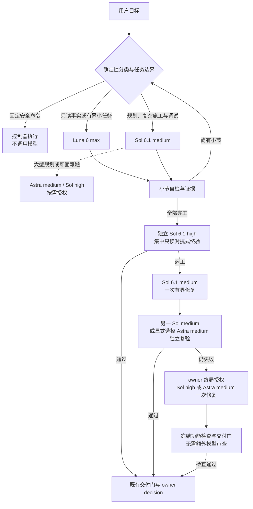
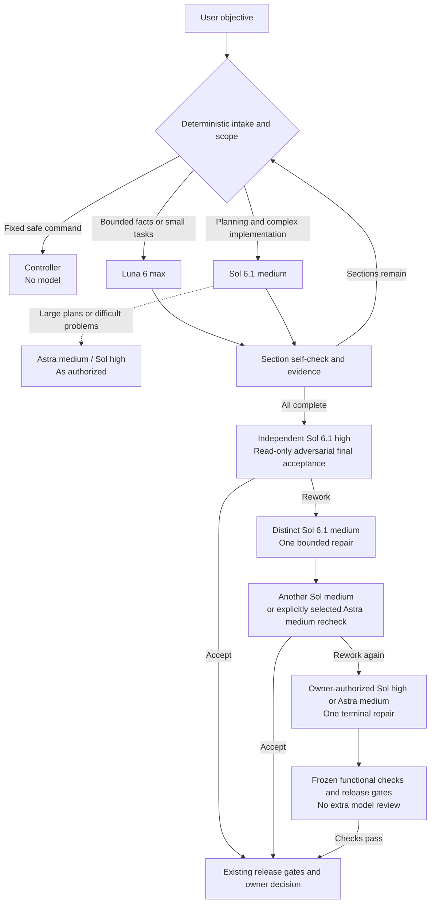

# Codex Team

[English overview below](#english-overview) · [Full English documentation](README.en.md)

Codex Team 是一个面向 Codex 的本地、可恢复、可审计的半自动多模型协作工作流。它把“谁来做、能改什么、何时停下、谁来验收”从模型自由发挥，收束为任务信封、确定性路由、运行时身份、证据链和人工闸门。

它解决的是多模型协作中最容易失控的三件事：低成本模型被派去做不适合的工作、施工范围在返工中逐渐扩大、验收结论缺少可追溯证据。Codex Team 用一套小而硬的控制面把这些边界固定下来，同时保留人工 owner 对高风险决策的最终控制权。

适合：个人开发、实验性项目、需要同时利用不同模型能力且希望保留审计轨迹的本地工作流。它不是后台常驻服务，不承诺自动替用户做产品决策，也不会替用户隐式 merge、push 或删除工作区。

| 项目状态 | 当前值 |
|---|---|
| Plugin 版本 | `0.4.1` |
| 发布形态 | Public preview；自用优先，不承诺生产 SLA |
| 默认 Luna 执行面 | 原生 `NATIVE_SUBAGENT`：`gpt-6-luna / max` |
| 入口分类 | 确定性规则；默认不为分类启动模型 |
| 默认主施工角色 | GPT-6.1 Sol：`gpt-6.1-sol / medium` |
| 集中整体终验 | 独立的 GPT-6.1 Sol：`gpt-6.1-sol / high`，只读、对抗式 |
| 最近更新 | 2026-09-30 |
| 许可证 | 尚未声明；公开可见不等于授予再分发许可 |

## 这是什么

Codex Team 由标准库实现、Schema、Plugin 镜像、CLI 和测试组成。生产路径以零模型控制面为核心：先校验任务和证据，再按冻结的角色、范围和命令执行；只有被明确授权的环节才会启动模型。

核心分工：

| 角色 | 默认模型 / 档位 | 主要职责 | 明确边界 |
|---|---|---|---|
| Luna Max | `gpt-6-luna / max` | 同类合并、范围明确、机械可验证的小任务，以及检查和证据整理 | 失败携带证据交回主施工角色；不反复试错、不规划、不验收 |
| 主施工角色 | `gpt-6.1-sol / medium` | 日常统筹、普通项目规划、复杂施工、调试、集成和首轮有界返工 | 不 merge、push 或自我验收 |
| 集中验收与困难升级 | `gpt-6.1-sol / high` | 全部小节完成后的独立、只读、对抗式终验；困难问题与授权终局修复 | 按需调用；只读终验与授权修复分属不同阶段 |
| Astra medium | `gpt-6-astra / medium` | 大型规划、顽固难题、审查分歧的补充独立复验，或授权终局修复 | 非普通项目必经步骤；复验只读，终局修复须 owner 授权 |

普通计划不固定转交 Astra。首轮返工由 Sol medium 优先承担，再由另一 Sol medium 独立复验；需要补充视角时显式选择 Astra medium。复验仍失败，只允许经既有 owner 授权执行一次 Sol high 或 Astra medium 终局修复，随后必须通过冻结功能检查和既有交付门。

内部历史 role/command ID 仅用于兼容：主施工仍使用 `terra_xhigh`，集中 Sol high 终验使用 `sol_reviewer`，Sol medium 返工/复验使用 `sol_medium_reviewer`，Astra medium 复验使用 `astra_medium_reviewer`；`sol_xhigh` 与 `authorize_final_xhigh` 是 Astra/终局授权的兼容句柄。实际身份以配置、模型、档位和运行时收据为准。

## 路由工作示意

入口使用确定性规则；小任务直接处理，有价值的独立工作才委派。中间工程小节采用 `section_self_check_only`，全部完工后才集中终验。



默认最多同时委派 2 个子代理，其中最多 1 个写入者、最多 2 个只读者；单步派发也执行容量检查。Team Call 自身仍保持单 active receipt。Luna 同类工作合并派发；失败后交回证据，主施工角色按冻结范围处理或重新取得有界信封。验收一次集中列出实质缺陷，给出需求依据、影响和可复现检查，不把个人偏好变成追加工程。

成本与提速效果尚待实测：观察后续 10–20 个真实任务的总消耗、耗时、首次通过率、返工次数和验收后遗漏。使用既有 report/cost evidence，不新增评测框架；API 成本与订阅额度分开记录。

## English overview

Codex Team is a local, resumable, auditable, semi-automated multi-model workflow for Codex. It turns “who acts, what they may change, when they must stop, and who accepts the result” into explicit task envelopes, deterministic routing, runtime identity, evidence chains, and human gates.

It is designed for personal development, experiments, and local workflows that combine different model capabilities without losing an audit trail. It is not a background service, does not make product decisions for the user, and never implicitly merges, pushes, or deletes a workspace.

### Default role split

| Role | Model / effort | Responsibility | Boundary |
|---|---|---|---|
| Luna Max | `gpt-6-luna / max` | Batch bounded, mechanically verifiable tasks, checks and evidence extraction | Hand failures and evidence back; never plan, review, approve or retry repeatedly |
| Primary implementer | `gpt-6.1-sol / medium` | Routine coordination, ordinary planning, construction, debugging, integration and first bounded repair | Never merge, push or self-accept |
| Final reviewer and difficult-work escalation | `gpt-6.1-sol / high` | Independent, read-only, adversarial final acceptance; difficult work or authorized terminal repair | Review and scoped-write repair are separate phases |
| Astra medium | `gpt-6-astra / medium` | Large-project planning, stubborn problems, supplementary independent recheck or authorized terminal repair | Optional; rechecks stay read-only and terminal repairs require owner authorization |

Ordinary plans stay with Sol medium. After Sol high final acceptance recommends rework, a distinct Sol medium fixer repairs the frozen findings. Another Sol medium independently rechecks; explicitly select Astra medium when an additional perspective is needed. A failed recheck permits only one owner-authorized Sol high or Astra medium terminal repair. Frozen functional checks and existing release gates remain mandatory, without additional task-level model review.

Historical role/command IDs remain compatibility handles: `terra_xhigh` means the primary implementer, `sol_reviewer` means Sol high final acceptance, `sol_medium_reviewer` means Sol medium repair/recheck, and `astra_medium_reviewer` means Astra medium recheck. `sol_xhigh` and `authorize_final_xhigh` retain their compatibility IDs. Runtime receipts establish the actual model, effort and permissions.

### Routing at a glance

Deterministic intake selects the authorized envelope. Intermediate engineering sections use `section_self_check_only`; final acceptance runs only after all sections complete.



At most two subagents run by default, with at most one writer and two readers; single-step dispatch also checks capacity. Team Call retains its single active receipt. Delegate only useful independent work, batch related bounded tasks, and pass relevant context with every required scope and identity field intact.

Observe the next 10–20 real tasks using existing reports and cost evidence: total consumption, elapsed time, first-pass acceptance, reworks and missed defects. Savings are not yet measured; API costs and subscription usage are tracked separately.


For installation, CLI usage and evidence requirements, see the [full English documentation](README.en.md).

## 快速开始

要求：Python 3.11+、Git、POSIX shell；Plugin verifier 需要 `jq`。项目不增加第三方 Python 依赖。

```sh
git clone https://github.com/New2taste/codex-team.git codex-team
cd codex-team

sh scripts/verify_all.sh
```

可选的 Skill 检查（需要本机已安装 Codex skill-creator）：

```sh
python3 "$CODEX_HOME/skills/.system/skill-creator/scripts/quick_validate.py" \
  plugins/ai-workflow/skills/orchestration
```

## Codex Team 调用

在 Codex 聊天中使用 `team call` 触发本 Skill；原生 `codex` CLI 没有 `team` 子命令。只解析消息开头的三种形式：

```text
team call <objective>
team call: <objective>
team call：<objective>
```

示例：

```text
team call 检查当前工作区状态
team call 核对文件 README.md
```

仓库内的等价测试入口：

```sh
python3 scripts/ai_workflow.py team-call \
  "team call 检查当前工作区状态" \
  --repository-root "$PWD"
```

Codex Team 只有四种受限 disposition：

- `DIRECT_L0`：控制器执行固定 allowlist argv，不调用模型；
- `DIRECT_L1`：Luna 只读抽取一个安全的仓库相对文件；
- `PLAN_REQUIRED`：创建真实持久任务与 hash-bound handoff；默认/fake 只登记待派发，显式 live 调用 Sol medium 只读规划并停在既有 owner gate；
- `BLOCKED`：输入、锁、权限或执行证据不满足要求。

它不自动修改、合并、推送或替代最终整体验收。失败收据以退出码 `2` 返回，并保留 append-only 账本。

一般任务不再返回空 `task_id`。在 Codex 中由 orchestration Skill 消费 `<state_root>/<task_id>/team-call-handoff.json`，实际派发 Sol medium 继续已授权规划/施工、运行功能验证，再集中 Sol high 终验；CLI 自身不声称完成施工。重复相同调用只回放，不新建任务或再次启动模型。native 模式记录实际 agent/thread、model/effort、cwd、权限和结果，不把分类或待派发文件当运行证据。权限/环境失败（例如 macOS Chrome 注册启动失败）不计作实现返工，不在相同沙箱反复启动；缺少执行能力或授权时明确阻塞。

For general Team Call tasks, the CLI persists a bound planning task/handoff. Default/fake intake starts no model; explicitly authorized live mode runs real Sol medium read-only planning and stops at the owner gate. The orchestration Skill consumes that handoff and continues actual authorized implementation and verification with independent Sol high final acceptance. A task ID or handoff is not completion; native runtime evidence must establish the actual model, effort, agent/thread and permissions. Replay never launches a second task.

真实对照复用现有 `cost.jsonl`、runtime evidence 和 `report`，两组各用独立 state root，对齐目标、起始版本、权限和验收标准。先观察 10–20 个真实任务，记录总消耗、耗时、首次通过、返工、漏检和环境阻塞；单 Sol medium 组须真实运行，缺失用量不记为零，不提前宣称节省。API 成本与订阅额度分开。低档 Luna 仅做单独有界试验，生产默认仍是 max。

Compare real Team and single-Sol-medium tasks using existing cost/runtime/report records with separate state roots and matched starting revision, objective, permissions and acceptance criteria. Record 10–20 real cases; unknown usage stays unknown. Keep API cost separate from subscription quota and do not claim savings before measurement. Lower Luna efforts are experiments only, not production defaults.

## 工作流

### 1. 规划

```text
目标 → 任务信封/确定性证据校验
→ 必要时用 DIRECT_L1 Luna 做有界事实抽取
→ 普通项目缺少计划时由 Sol medium 补齐；大型规划按需选 Astra medium
→ owner decision
```

### 2. 施工与验收

```text
冻结 envelope → 有界施工 → 目标测试/负向检查/范围核对
→ 全部工程小节完成 → 固定 candidate commit
→ GPT-6.1 Sol high final acceptance → owner decision
```

中间工程小节采用 `section_self_check_only`：施工 owner 必须完成信封内的测试、负向检查、范围核对和运行时证据门，但不再逐小节派发独立对抗式审查。自检不等于验收。

通用 `ACCEPTANCE` task 保留 主施工角色 reviewer，供显式的本地审查使用；它不是全工程 final acceptance。正常计划执行不会为每个中间小节创建这类 task。scheduler 在全部小节 receipt 完成后创建唯一 `ACCEPTANCE` child：final candidate 必须是当前 clean HEAD，且是 FrozenPlan 初始 candidate 的后代，diff 不得越出 step/parent write union；`FINAL_ACCEPTANCE_OPENED` 绑定 child task hash，child 的 `scheduler-parent.json` 定向绑定唯一 parent/plan/event/candidate。`schedule-final` 只签发一次 GPT-6.1 Sol high `REVIEW_1`；不为中间小节调 reviewer，也不自动跑模型。

### 3. 验收后返工

```text
GPT-6.1 Sol high REWORK
→ 人工批准冻结 findings / paths / commands
→ different GPT-6.1 Sol medium fixer 有界返工
→ 另一 Sol medium independent read-only recheck，或显式选 Astra medium
→ 仍 REWORK 才可 owner-authorized Sol-high / Astra-medium terminal repair
```

返工不能扩大 candidate、允许路径或验证命令；Astra medium 的 terminal repair 是一次性例外，不产生普通常驻施工权限。

## 身份与证据

默认 Luna 使用 `NATIVE_SUBAGENT`，运行时必须同时证明：

- workflow role：`luna`；
- model / reasoning effort：`gpt-6-luna / max`；
- `agent_type=null`；
- native agent UUID、thread UUID、sandbox、permission 和 cwd；
- 受控调度参数与运行时 rollout 证据一致。

`CODEX_EXEC_ROLE_CONTRACT` 是另一种独立执行面，不能冒充原生 Luna。任一身份、权限、线程、模型或档位证据缺失/冲突时，流程 fail-closed。

每项任务围绕固定 `base_commit`、`candidate_commit`、授权文件集合和验证命令运行。状态、结果、成本、运行时证据、人工决策和返工事件均使用严格 Schema 或 append-only ledger 保存。

## 安全边界

- 写入必须在具名隔离 worktree 和冻结路径内进行；
- 只读角色产生文件变化、HEAD 漂移、范围越界或证据缺失时立即 `BLOCKED`；
- 不把项目密钥传给子进程，日志不记录环境变量和完整原始数据；
- 默认不自动 merge、push、删除 worktree 或修改全局配置；
- 任务范围、运行时身份和证据不一致时立即停止，不依赖模型自行解释。

## 目录结构

```text
config/                         # 任务、路由、计划、结果、运行时、成本与影子建议 Schema
scripts/ai_workflow.py          # 主 CLI、状态机和 Codex Team 生产入口
scripts/ai_workflow_runtime.py  # native/exec 身份与 runtime evidence
scripts/ai_workflow_artifacts.py# 严格 artifact 校验和数据类
scripts/ai_workflow_routing.py  # 主施工角色 闭集路由；optimization 只写 sidecar
scripts/ai_workflow_planning.py # 计划和施工 envelope
scripts/ai_workflow_scheduler.py# 计划调度、receipt 与 final ACCEPTANCE child
scripts/ai_workflow_repairs.py  # acceptance repair ledger v2
scripts/ai_workflow_team_call.py# Codex Team grammar、分类和收据
scripts/ai_workflow_router_probe.py # 常驻路由器离线 shadow 探针与报告
scripts/sync_plugin.py           # 固定 manifest 的 Plugin 检查/同步
scripts/verify_all.sh            # 零模型完整验证入口
plugins/ai-workflow/             # 对外 Plugin；runtime/config 与根目录同步
tests/                           # fake runner、负向注入和发布一致性测试
```

CLI 命令：`new`、`validate`、`team-call`、`run`、`route`、`schedule-batch`、`schedule-result`、`schedule-receipt`、`schedule-final`、`status`、`decide`、`resume`、`abort`、`report`。调度链按 `schedule-batch --task TASK --plan PLAN` 取得冻结批次；小节执行在既有 runner 边界外完成后，controller 用 `schedule-result TASK_ID --plan PLAN --dispatch-id ID --result RESULT` 将 `ai-result-1` 补齐并严格核对 `dispatch_id/task_id/step_id/attempt` 自绑定后，原子写入由 dispatch 唯一确定的 `scheduler-results/<dispatch_id>.json` 并输出 receipt；结果文件拒绝 symlink、hardlink、目录换绑和超限内容。`schedule-receipt` 记录该 receipt。全部完成后，`schedule-final` 创建集中终验 child；再次同时提供 `--owner-receipt` 与 `--acceptor` 时签发首个 GPT-6.1 Sol high `REVIEW_1`。终验返工梯到达授权点后，owner 通过既有终局授权接口触发授权的 Sol high 或 Astra medium；兼容命令 ID `authorize_final_xhigh` 保持不变。

`[optimization]` 默认 `mode=shadow`，由 `evaluate_and_apply_route_advice` 读取，与 `route --mode` 的 routing 模式分开。`actual_route`/`recommended_route` 只进入 runtime advice 与 `ai-route-advice-1` sidecar，永不改 `ai-route-decision-1` 九字段或生效 roles。`mode=enforced` 仅当内部计算的四门全过且推荐是闭集成本降级时才应用；否则固定链回退。缺 miss 报告或缺省 period/origin 不能开门。Scheduler 在 shadow 下不执行推荐。

`scripts/ai_workflow_router_probe.py` 是独立的常驻路由研究工具，不接入生产路由，也不写 task store。这里的“常驻”仅指固定模型、冻结 prompt 前缀、每次新会话和时间聚簇；不复用跨任务长线程。候选闭集只有 Luna、Sol、Terra，并为每个模型保留冷前缀对照。项目说明建议：若要常驻一个模型做入口分类，优先选 Luna max（高频短沟通、单价更低）；这不是实测成本赢家，也不改生产 `effective_route`，实际仍以使用者选择为准。默认 `dry-run` 为零模型；fake 示例：

该探针是根目录的研究工具，刻意不复制到 Plugin runtime；Plugin 只分发生产运行时以及探针所需的配置和 Schema。

```sh
python3.11 scripts/ai_workflow_router_probe.py \
  tests/fixtures/router-probe/cases.json \
  --runner dry-run

output_root="$(mktemp -d)"
python3.11 scripts/ai_workflow_router_probe.py \
  tests/fixtures/router-probe/cases.json \
  --runner fake \
  --output-root "$output_root"
```

live 历史案例重放必须先把 pinned `[router_probe].enabled` 设为 true，并同时显式传 `--runner live --allow-live-model`；配置中的三模型/推理档与代码闭集不一致时直接失败。输出根目录必须位于所有 Git 仓库之外的已存在绝对目录。未达到 32 个完整配对案例（四层各至少 8 个）、使用 synthetic/unavailable 数据、缺臂、前缀漂移或 token 缺失时，报告只能给出 `OBSERVATION_ONLY`。即使出现 `CACHE_MECHANISM_CANDIDATE_*`，它也只说明哪个模型的热前缀节省了更多 uncached input；缺少带日期/来源的费率快照和下游反事实成本时，真实成本赢家仍标为 unavailable。`effective_route` 固定为 `UNCHANGED`，R4 生产集成不在当前范围。

compact prompt 是双钥匙 armed 字段投影，不改变角色语义，也不做摘要或 LLM 压缩。公开 `build_role_prompt` / `build_construction_role_prompt` 只从 pinned `[optimization]` 与 `aggregate_metrics(state_root)` 决策，调用方不能传 config/metrics 武装 compact；无 state_root、shadow、缺/非法 metrics 或门未过时一律完整 prompt。只有 `[optimization].compact_prompts=true`、`mode=enforced`，且 `evaluate_optimization_gate==ALLOW_ENFORCED`，并且 compact UTF-8 bytes 小于 full 才生效。投影必须逐字保留 task_id、schema/role 身份与角色指令、objective、repository_root/source_worktree、base_commit/candidate_commit、authoritative_files、allowed_write_paths、forbidden_actions、risk_flags、acceptance_commands、verification_level、human_gates，以及调用上下文中的 frozen plan/step id、write_scope、acceptance criteria、dependencies、permission profile、candidate/evidence hashes、runtime/session bindings、owner decisions/authorization tickets 和 required output schema/path；并保留 full prompt 中的证据授权句。未知关键字段默认保留或禁用 compact。acceptance repair ladder 的 assignment prompt 不参与 compact，永远 full。

`resume <task_id>` 从已持久化状态继续；施工任务会复用 owner gate 前冻结的 plan、route request、step 和 attempt。重复恢复终态或门状态不会重复派发。`abort <task_id>` 只追加 owner 决策和 `ABORTED` 状态，不删除已有任务、结果或证据。`decide ... --resume` 可在一次显式命令中记录决策并继续；live 恢复仍必须重新提供 `--allow-live-model` 和有效的绝对 `--runtime-sessions-dir`。`decide <task_id> authorize_final_xhigh` 是保留的兼容命令 ID；它只调用 repairs 的 owner 授权接口，由授权的 Sol high 或 Astra medium 执行一次终局修复，不进入通用 `OWNER_DECISIONS` / REMEDIATION 状态机，也不得与 `--resume` 组合。

## 验证与开发

```sh
sh scripts/verify_all.sh
```

`python3.11 scripts/sync_plugin.py --check` 只检查固定 manifest；`--write` 才会把根目录权威文件原子复制到 Plugin。完整验证还会执行单测、compileall、Plugin verifier、shell 语法和 `git diff --check`。发布前仍要在临时副本中篡改一个镜像文件，确认 verifier 返回非零。

## 当前限制

- public preview，不提供生产 SLA；
- 真实 live rollout、模型服务可用性和计费数据需要在实际 Codex 环境中单独验证；
- Windows 原生生命周期不在当前验证范围内。

## 文档

- [架构说明](docs/ARCHITECTURE.md)
- [开发与验证指南](CONTRIBUTING.md)
- [变更记录](CHANGELOG.md)
